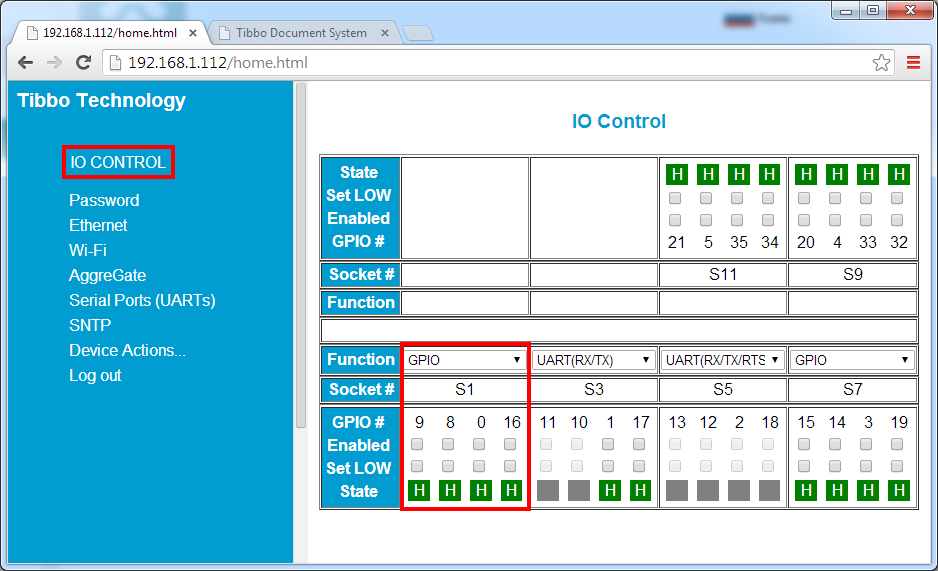
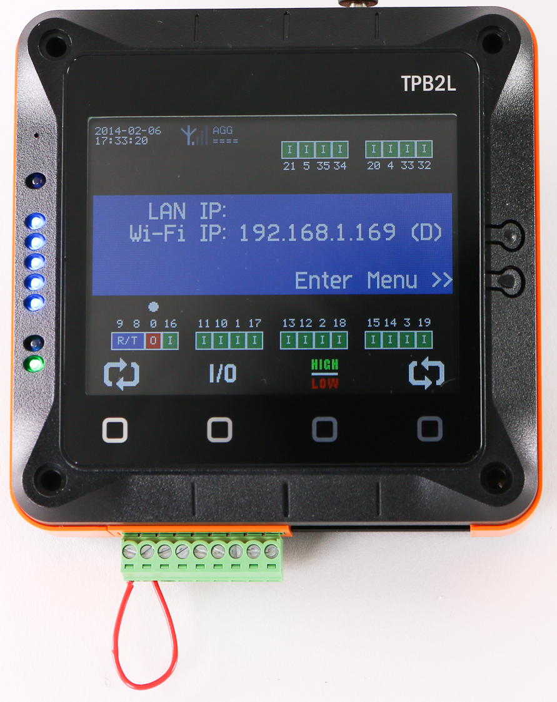

# Official TPS Demo Application

This TPS Demo application is a great tool for testing [Tibbo Project System](http://tibbo.com/tps.html) devices. The application allows you to control the I/O lines and serial ports of [TPP2 and TPP3](http://tibbo.com/tps/tpp.html) boards. A very simple set of hardware is minimally required for the tests, yet the application itself is sufficient for working with various [Tibbits](http://tibbo.com/tibbits.html) such as relays, sensor inputs, and so on.

The application is written to work with Ethernet and Wi-Fi interfaces, with plans to support GPRS communications in the near future.

The application demonstrates how to control your TPS system via the [DS Manager](http://tibbo.com/soi/software.html#ds-manager) utility, through the web interface, and the [AggreGate Server](http://aggregate.tibbo.com/). The Demo also supports the LCD and keypad of [TPS2L](http://tibbo.com/store/tps/barebone-tps.html) devices.

To test the TPS app you can either upload pre-compiled binaries which are available for all three TPS systems (TPS2, TPS2L, TPS3), or open the project in TIDE and compile it yourself.

Either way, the first time this application runs on your TPS device it will initialize a number of EEPROM settings. This will take some time at first boot, after which the device will reboot and start running normally.

The Demo application is documented in its own manual:

[PDF File](http://tibbo.com/downloads/open/tps_app_manual.pdf) | [Windows e-book (.exe)](http://tibbo.com/downloads/open/tps_app_manual.exe)

#### Web Interface

 

#### 

#### Main LCD Interface